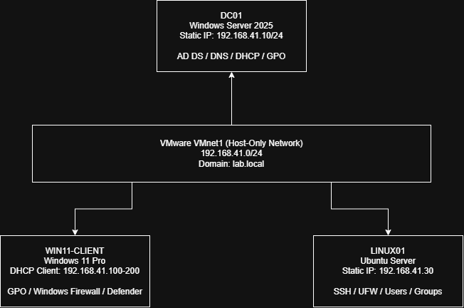
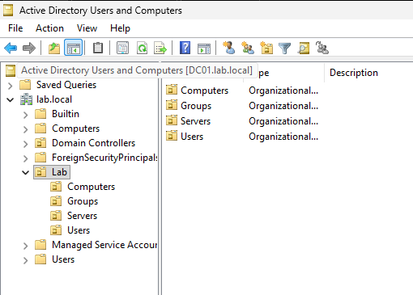
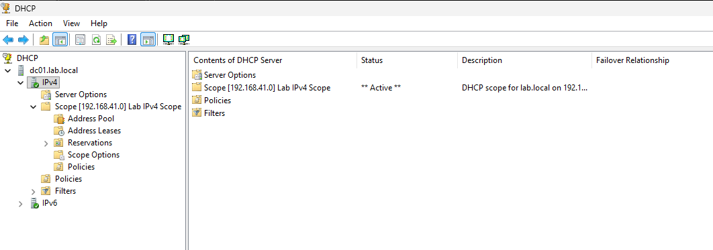
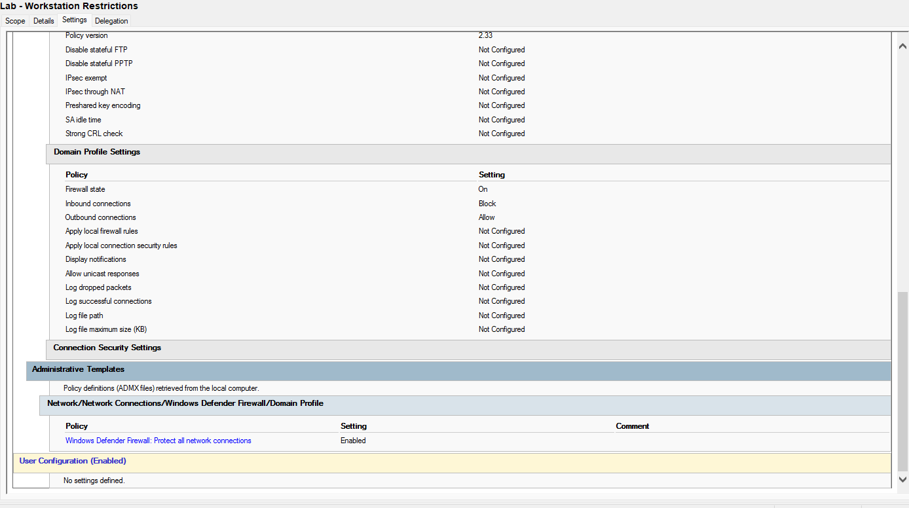
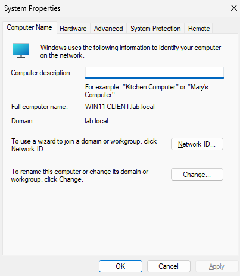
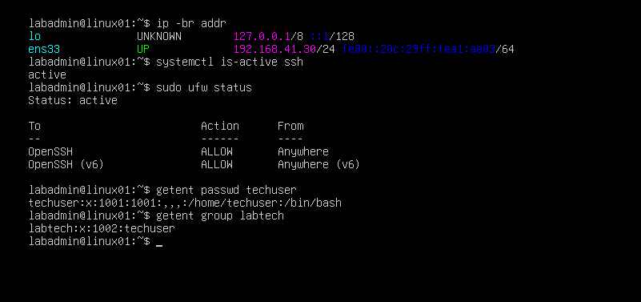

# Windows & Linux Infrastructure Homelab

## Project Overview

A 3-VM homelab built in VMware Workstation Pro using Windows Server 2025, Windows 11, and Ubuntu Server to practice Windows administration, Active Directory, networking, Linux administration, and Windows Firewall and UFW  configuration.

## Lab Environment

| System | Role | IP Address |
|---|---|---|
| Windows Server 2025 | Domain Controller, DNS, DHCP | 192.168.41.10 |
| Windows 11 | Domain-joined Client | DHCP |
| Ubuntu Server | Linux Server | 192.168.41.30 |

**Network:** VMnet1 Host-Only  
**Subnet:** 192.168.41.0/24

## Network Architecture

The lab uses an isolated VMware host-only network. Windows Server provides Active Directory, DNS, DHCP, and Group Policy services. The Windows 11 client is domain-joined, while Ubuntu Server uses a static IP and SSH for remote administration.

## Windows Server 2025 Setup

### Active Directory Domain Services
- Installed AD DS and promoted the server to a domain controller.
- Created organizational units, user accounts, security groups, and group memberships.

### DNS
- Configured DNS on the domain controller.
- Verified host and Active Directory service records.

### DHCP
- Configured a DHCP scope for the lab network.
- Used DHCP to provide network settings to the Windows 11 client.

### Group Policy
- Created Group Policy settings for the domain.
- Configured Windows Firewall settings for the domain profile.

## Windows 11 Client

- Joined the Windows 11 VM to the domain.
- Verified domain user authentication.
- Confirmed DHCP and DNS configuration.
- Verified Group Policy application.

## Ubuntu Server

- Configured a static IP address.
- Enabled SSH.
- Configured UFW.
- Created local users and groups.
- Verified the server's IP configuration, SSH service status, UFW rules, and local user/group setup.

## Key Takeaways

This project gave me hands-on experience with Windows Server, Active Directory, DNS, DHCP, Group Policy, Linux administration, SSH, basic firewall configuration, and VMware networking.

## Future Improvements

- Expand Group Policy configuration.
- Add PowerShell automation.
- Add centralized logging.
